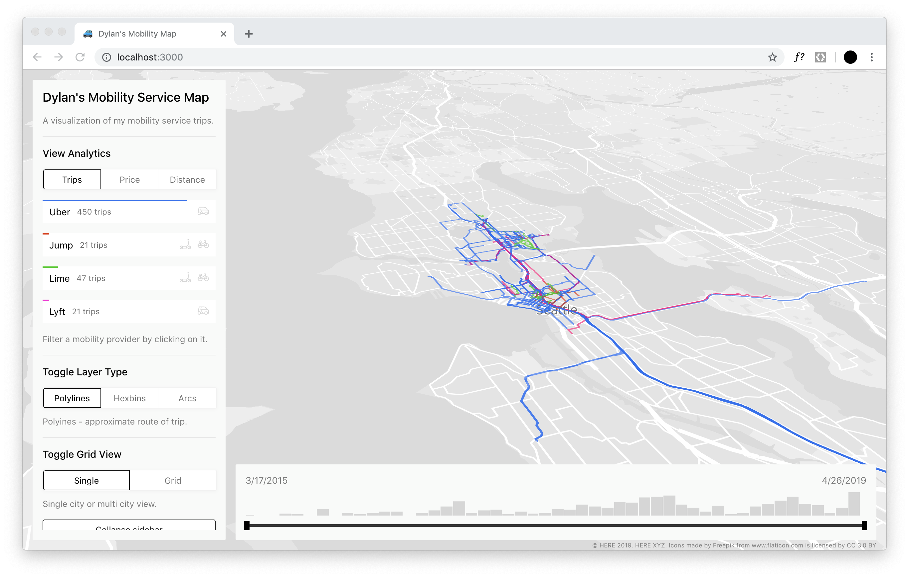

# Dylan's Mobility Service Map

__[View live map](https://dbabbs.github.io/mobility-map/)__



This project is an interactive visualization of my mobility service provider trips. I aggregated data from [Uber](https://www.uber.com/), [Jump](https://jump.com/), [Lyft](https://www.lyft.com/), and [Lime](https://www.li.me/) in order to make this map.

Explore trips across multiple cities using the grid view, filter trips by time with the histogram date filter, or explore total distance travelled by provider.

## How this was made

### Data access

Uber provides a handy [data download tool](https://help.uber.com/riders/article/download-your-data?nodeId=2c86900d-8408-4bac-b92a-956d793acd11) that provides access to all Uber trips, UberEATS orders, and JUMP trips. Submit a request for your data and it should be ready to download in a few hours.

Lyft enables a download of your trips through the *Ride History* in the mobile app. You can email yourself a CSV of your recent trips.

Lime was a little more difficult to get a copy of my data. They do not provide an easy export of your trip data like Uber and Lyft. Since I had used Lime in Berlin, I was eligible to request a copy of data under [Article 15 of GDPR - Right of access by the data subject](https://gdpr-info.eu/art-15-gdpr/). Nearly 2 months and 10+ emails later with Lime, I finally received a copy of my data.

### Enriching the data

Except for Lime, my trips data only included start and end addresses. The actual path travel was not included in the data downloads. In order to draw polylines on the map, I used the [HERE Routing API](https://developer.here.com/documentation/routing/topics/introduction.html) to calculate the estimated route from the starting point to the ending point. This process happened in the `prep/index.js` file.

### Visualizing the Data
- [React](https://reactjs.org/) was used to build the client UI
- [deck.gl](http://deck.gl) was used for the geospatial visualizations

## Installation

```
git clone https://github.com/dbabbs/mobility-map.git
cd mobility-map
npm install
npm start
```

## Make your own map

You are welcome to recreate this project with your own mobility data.

`prep/index.js` is a helpful script to help wrangle and enrich your data into the proper GeoJSON format. Once you run your data through that script, it can be plugged into the React application.
